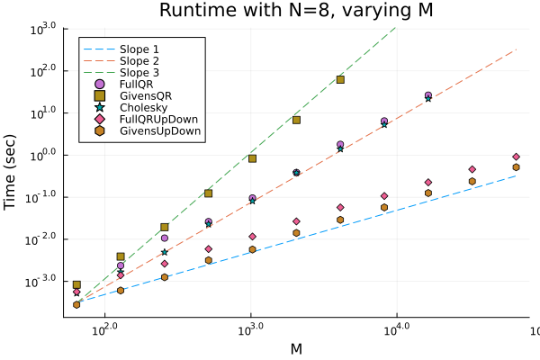

# CaratheodoryPruning.jl Documentation

TODO: Describe the problem geometrically, perhaps a figure.

TODO: Describe the problem in a Linear Algebraic format.

The base caratheodory pruning method takes in a matrix `V` of size `M` by `N`, and a vector of weights of length `w_in`.
It then returns a pruned vector of length `M` weights, `w`, and the nonnegative indices, `inds`.
If `return_errors` is set to true, additionally returns a vector of moment errors at each iteration.

```@docs
caratheodory_pruning
```

Here is a full example of generating a random matrix `V` and random, positive vector of weights `w_in`, computing the moments `eta`, using `caratheodory_pruning` to generate pruned weights `w`, and computing the moment error.

```@example 1
using CaratheodoryPruning
using Random
using Random: seed! # hide
seed!(1) # hide
M = 100
N = 10
V = rand(M, N)
w_in = rand(M)
eta = transpose(V) * w_in
w, inds = caratheodory_pruning(V, w_in)
w[inds]
```
```@example 1
error = maximum(abs.(V[inds,:]'w[inds] .- eta))
```
TODO: Higher dpi images for documentation.
